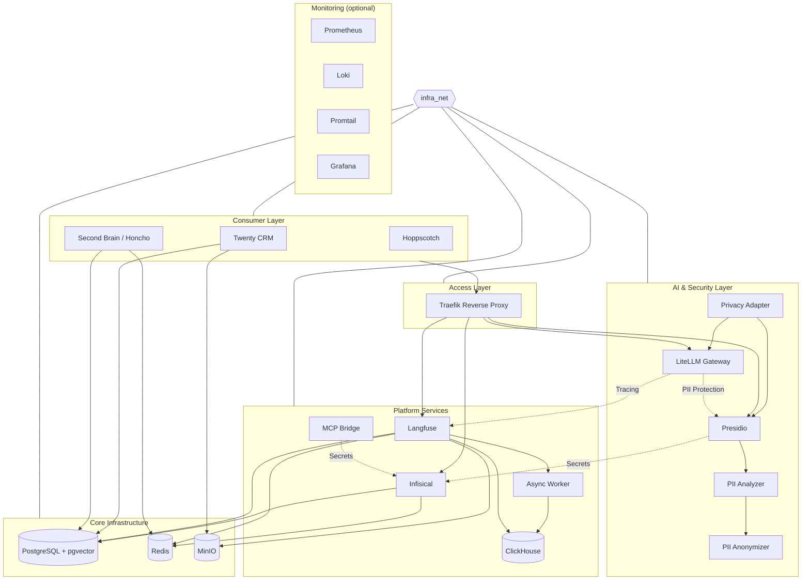
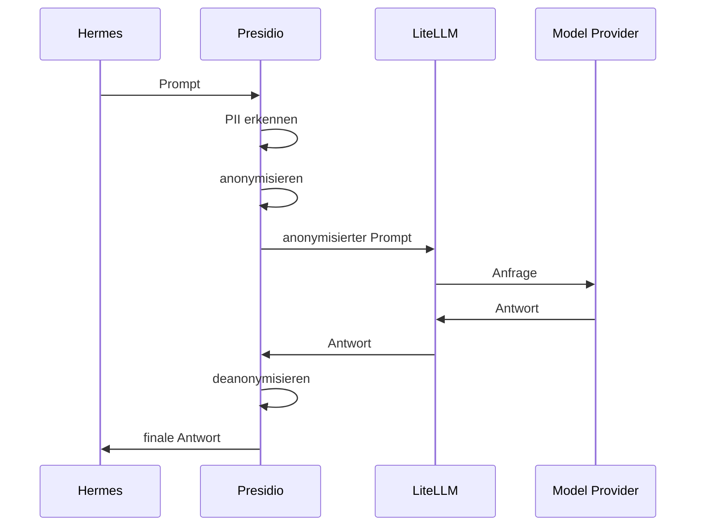
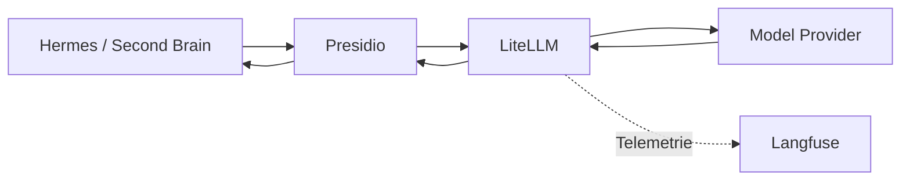
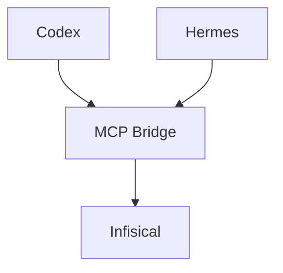

# docker-infra-stack

Self-hosted Docker-Infrastruktur als gemeinsame Basis für lokale Anwendungen, AI-Gateway, Observability, Secret Management und Second-Brain-Komponenten.

> **Zwei Stack-Ebenen, ein Netzwerk:** `infra_stack_application/` (Core Infrastructure) und `service_stack_application/` (Platform Services) teilen sich das externe Docker-Netzwerk `infra_net`.

---

## Kurzvorstellung

https://github.com/user-attachments/assets/52d42371-e276-4f13-87a1-88be02599806

---

## Architecture

### Layer Model

```
┌──────────────────────────────────────────────────────────────────────────┐
│                           CONSUMER LAYER                                 │
│           Twenty CRM · Second Brain · Hoppscotch · + weitere             │
└───────────────────────────┬──────────────────────────────────────────────┘
                            │ *.localhost
┌───────────────────────────▼──────────────────────────────────────────────┐
│                           ACCESS LAYER                                   │
│                       Traefik Reverse Proxy                              │
└───────────────────────────┬──────────────────────────────────────────────┘
                            │ routing
            ┌───────────────┼───────────────┐
            │               │               │
┌───────────▼───────────┐   │   ┌───────────▼───────────┐
│   AI & SECURITY LAYER │   │   │   PLATFORM SERVICES   │
│   Presidio            │   │   │   Infisical           │
│   LiteLLM Gateway     │   │   │   Langfuse + Worker   │
│   Privacy Adapter     │   │   │   ClickHouse          │
└───────────────────────┘   │   │   MCP Bridge          │
                            │   └───────────────────────┘
                            │
               ┌────────────▼────────────┐
               │  CORE INFRASTRUCTURE     │
               │  PostgreSQL + pgvector   │
               │  Redis · MinIO S3       │
               └─────────────────────────┘
               ┌─────────────────────────┐
               │  MONITORING (optional)   │
               │  Prometheus · Loki       │
               │  Grafana · Promtail      │
               └─────────────────────────┘
```

### Complete Architecture



### Layer Details

| Layer | Komponenten | Beschreibung |
|-------|------------|-------------|
| **Consumer** | Twenty CRM, Second Brain/Honcho, Hoppscotch, Audio2Knowledge, Diagrams | Anwendungen, die auf der Infrastruktur laufen |
| **Access** | Traefik | Reverse Proxy mit Docker-Label-Routing (`*.localhost`) |
| **AI & Security** | Presidio (Analyzer + Anonymizer), LiteLLM Gateway, Privacy Adapter | PII-Schutz und LLM-Provider-Routing |
| **Platform** | Infisical, Langfuse, ClickHouse, MCP Bridge | Secret Management, Observability, Analytics |
| **Core** | PostgreSQL + pgvector, Redis, MinIO | Gemeinsame Daten- und Speicherdienste |
| **Monitoring** | Prometheus, Loki, Promtail, Grafana | Metriken, Logs, Dashboards (derzeit deaktiviert) |

---

## Key Flows

### Privacy Request Flow



### AI Gateway (geplant)



### MCP Bridge



---

## Built With

| Projekt | Website | GitHub-Quelle | Lizenz |
|---------|---------|--------------|--------|
| **Traefik** | [traefik.io](https://traefik.io) | [traefik/traefik](https://github.com/traefik/traefik) | MIT |
| **PostgreSQL** | [postgresql.org](https://www.postgresql.org) | [postgres/postgres](https://github.com/postgres/postgres) | PostgreSQL |
| **pgvector** | — | [pgvector/pgvector](https://github.com/pgvector/pgvector) | PostgreSQL |
| **Redis** | [redis.io](https://redis.io) | [redis/redis](https://github.com/redis/redis) | BSD-3 |
| **MinIO** | [min.io](https://min.io) | [minio/minio](https://github.com/minio/minio) | AGPL v3 |
| **Infisical** | [infisical.com](https://infisical.com) | [Infisical/infisical](https://github.com/Infisical/infisical) | MIT |
| **Langfuse** | [langfuse.com](https://langfuse.com) | [langfuse/langfuse](https://github.com/langfuse/langfuse) | MIT |
| **ClickHouse** | [clickhouse.com](https://clickhouse.com) | [ClickHouse/ClickHouse](https://github.com/ClickHouse/ClickHouse) | Apache 2.0 |
| **Presidio** | — | [microsoft/presidio](https://github.com/microsoft/presidio) | MIT |
| **LiteLLM** *(planned)* | [litellm.vercel.app](https://litellm.vercel.app) | [BerriAI/litellm](https://github.com/BerriAI/litellm) | MIT |
| **Prometheus** *(optional)* | [prometheus.io](https://prometheus.io) | [prometheus/prometheus](https://github.com/prometheus/prometheus) | Apache 2.0 |
| **Grafana** *(optional)* | [grafana.com](https://grafana.com) | [grafana/grafana](https://github.com/grafana/grafana) | AGPL v3 |

---

## Quick Start

```bash
# 1. Clone and enter
git clone https://github.com/patrick-reuver/docker-infra-stack-local.git
cd docker-infra-stack

# 2. Create .env files from templates
make env-example

# 3. Edit .env files with your values (Infisical bootstrap, DB credentials, etc.)
#    See each service's .env.example for required variables

# 4. Start infrastructure (Traefik, Postgres, Redis, MinIO)
make infra-up

# 5. Provision databases
make db-provision

# 6. Start services (independent, start what you need)
make clickhouse   # or: make langfuse, make presidio, make infisical

# 7. Verify health
make health
```

---

## Directory Structure

```
docker-infra-stack/
├── Makefile                          # Unified operations
├── .env.example                      # Root environment template
├── .gitignore                        # Security-hardened
│
├── infra_stack_application/          # Core Infrastructure (1 compose)
│   ├── docker-compose.yml
│   ├── .env.example
│   └── docker-compose.collation-remediation.yml
│
├── service_stack_application/        # Platform Services (separate composes)
│   ├── clickhouse/                   # Analytics DB
│   ├── infisical/                    # Secret management
│   │   └── infisical-mcp/            # MCP bridge for Codex/agents
│   ├── langfuse/                     # LLM observability
│   ├── litellm/                      # LLM gateway (in development)
│   └── presidio/                     # PII detection & anonymization
│
├── docs/
│   ├── architecture/                 # Architecture diagrams (.mmd)
│   ├── config_templates/             # Prometheus, Loki, Promtail configs
│   └── documentation/                # Runbooks (network, provisioning, etc.)
│
├── scripts/                          # Helper scripts
├── infrastructure.md                 # Network, volumes, routing docs
├── tools-and-services.md             # Complete tool/service inventory
└── databases.md                      # Postgres database inventory
```

---

## Services

| Service | Port (Internal) | Host (Traefik) | Status | Beschreibung |
|---------|----------------|----------------|--------|-------------|
| Traefik | 80 | `traefik.localhost` | ✅ aktiv | Reverse Proxy + Dashboard |
| PostgreSQL | 5432 | `postgres.localhost` | ✅ aktiv | pgvector/pg16, shared |
| Redis | 6379 | `redis.localhost` | ✅ aktiv | Shared, password-protected |
| MinIO | 9000 / 9001 | `minio.localhost` / `s3.localhost` | ✅ aktiv | S3-kompatibler Object Storage |
| Infisical | 8080 | `infisical.localhost` | ✅ aktiv | Secret Management UI + API |
| Langfuse | 3000 | `langfuse.localhost` | ✅ aktiv | LLM Observability, Tracing |
| ClickHouse | 8123 | `clickhouse.localhost` | ✅ aktiv | Analytics DB für Langfuse |
| Presidio Analyzer | 3000 | `presidio.localhost` | ✅ aktiv | PII Detection API |
| Presidio Anonymizer | 3000 | `presidio-anonymizer.localhost` | ✅ aktiv | Anonymization API |
| LiteLLM | — | `litellm.localhost` | 🔄 geplant | LLM Gateway / Provider Routing |
| Prometheus | — | — | ⏸️ deaktiviert | Metriken |
| Loki | — | — | ⏸️ deaktiviert | Log-Aggregation |
| Grafana | — | — | ⏸️ deaktiviert | Dashboards |

---

## Secret Management Model

**Standard-Betrieb:** Alle Secrets werden in **Infisical** verwaltet, pro Service unter eigenem Pfad:

| Pfad | Service |
|------|---------|
| `/langfuse` | DB/Redis/ClickHouse/S3-Credentials, Encryption Keys, Salts |
| `/presidio` | Modell-Konfiguration, Log-Level |
| `/clickhouse` | ClickHouse-Credentials |
| `/infisical` | App-Encryption-Keys, Auth-Secrets |

Jeder Service-Container startet nur mit **Machine Identity Bootstrap** in der `.env`:
- `INFISICAL_HOST_URL`, `INFISICAL_PROJECT_ID`, `INFISICAL_ENV`
- `INFISICAL_UNIVERSAL_AUTH_CLIENT_ID`, `INFISICAL_UNIVERSAL_AUTH_CLIENT_SECRET`

Der Runtime-Wrapper `scripts/infisical-runtime-env.sh` holt Secrets aus Infisical beim Start und injiziert sie als Umgebungsvariablen.

**Fallback (ohne Infisical):** Die `.env.example`-Dateien dokumentieren alle Secrets inline — für lokale Entwicklung ohne Infisical. Default auskommentiert.

---

## Makefile Commands

| Command | Beschreibung |
|---------|-------------|
| `make help` | Alle Commands anzeigen |
| `make infra-up` | Core Infrastructure starten |
| `make infra-down` | Core Infrastructure stoppen |
| `make infra-ps` | Infra-Status prüfen |
| `make svc-up SVC=langfuse` | Einzelnen Service starten |
| `make clickhouse` | Shortcut: ClickHouse starten |
| `make langfuse` | Shortcut: Langfuse starten |
| `make all-up` | Infra + alle Services |
| `make all-down` | Alles stoppen |
| `make env-example` | Alle `.env` aus `.env.example` erzeugen |
| `make db-provision` | Erforderliche Datenbanken anlegen |
| `make health` | Alle Endpunkte prüfen |
| `make clean` | Containers, Volumes, Network entfernen |

---

## Network

Alle Dienste nutzen das externe Docker-Netzwerk `infra_net` (wird automatisch von `make infra-up` angelegt). Interne DNS-Namen:

| Host | Port |
|------|------|
| `postgres` | 5432 |
| `redis` | 6379 |
| `minio` | 9000 |
| `infisical` | 8080 |
| `clickhouse` | 8123 |
| `langfuse-web` | 3000 |
| `presidio-analyzer` | 3000 |
| `presidio-anonymizer` | 3000 |

---

## Requirements

- Docker Engine + Docker Compose v2
- `infra_net` network (auto-created by `make infra-up`)
- Für Infisical-Modus: Laufende Infisical-Instanz mit Machine Identities
- `openssl` für Secret-Generierung (`openssl rand -hex 32`)

---

## Documentation

| Resource | Inhalt |
|----------|--------|
| `docs/architecture/` | Mermaid-Architekturdiagramme |
| `infrastructure.md` | Netzwerk, Volumes, Traefik-Routing, Credentials |
| `tools-and-services.md` | Vollständiges Tool/Service-Inventory mit Versionen |
| `databases.md` | Postgres-Datenbank-Inventar pro Anwendung |
| `docs/documentation/` | Runbooks (Onboarding, Provisioning, Troubleshooting) |
| Pro Service `README.md` | API-Usage, Config, Infisical-Pfade |

---

> MIT — Internal use, publish-ready when public.
